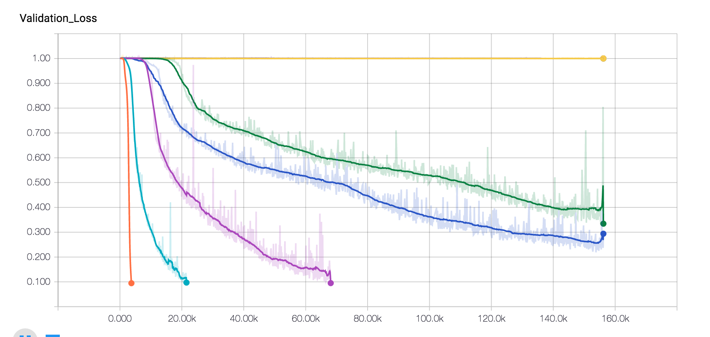
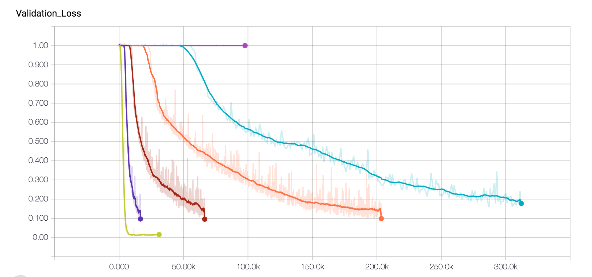
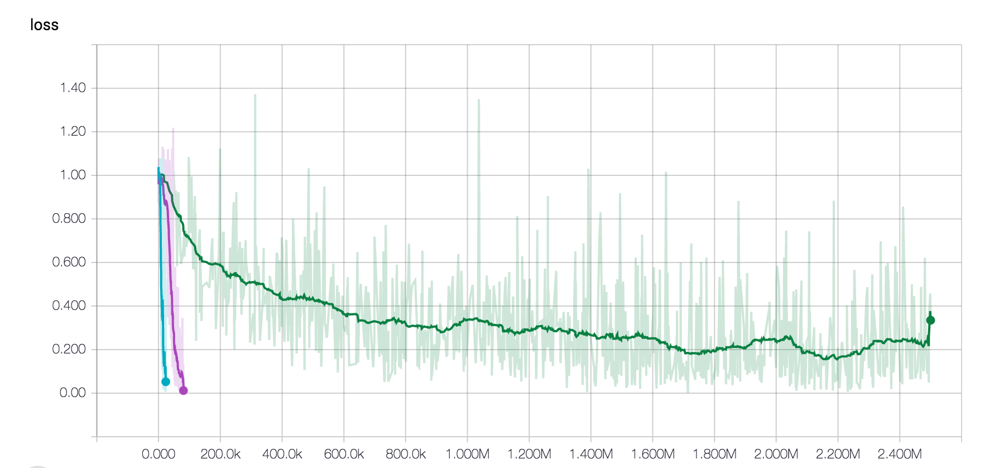
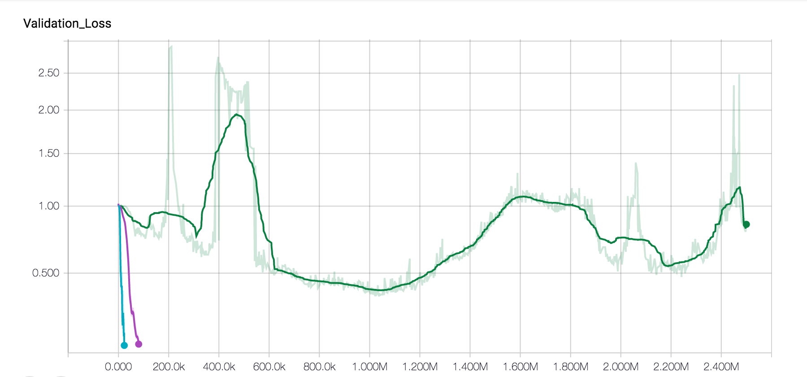
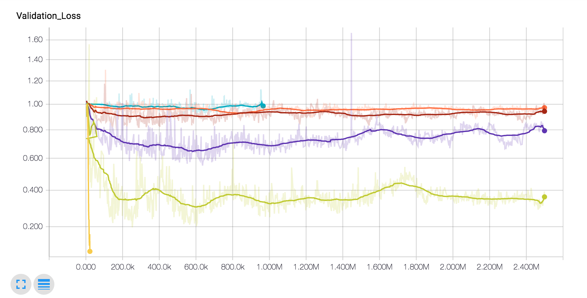
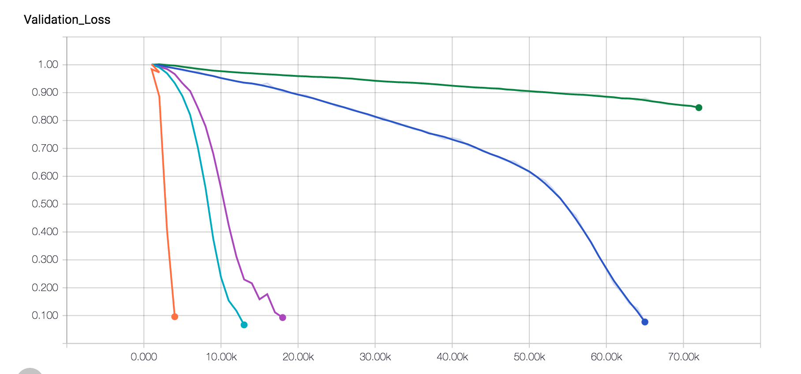
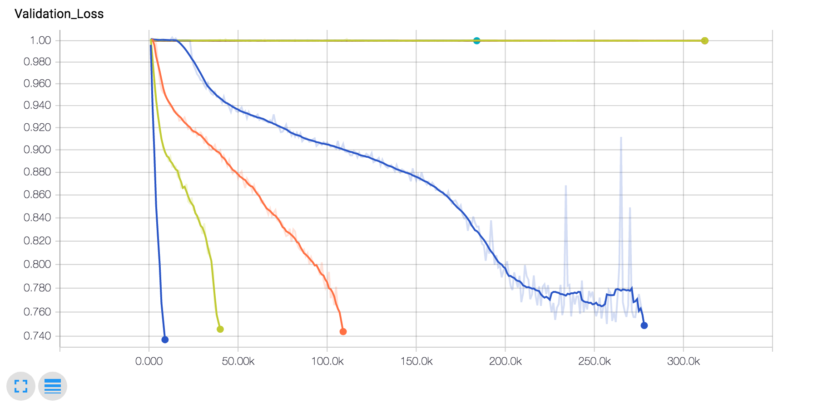

# Lossless compression using Neural Networks

## 0. Code
The Code is organized as follows:
1. **src** : Contains main code
2. **misc_code**: Contains previously experimented code
3. **data**: Contains data sources

## 1. Overview

### Motivation

Arithematic encoding has been used since past 20 years to achieve close to entropy compression for known distributions. Adaptive variants of Arithematic encoding \(for a chosen k-context model\) have also been designed, which first try to learn the conditional k-th order distribution, in the first pass nad use the same for compression in the second pass.

However, as the complexity increases exponentially in $$k$$, with the alphabet size. Generally the context is limited to $$k = 5,10$$. Higher values of context are not tractable. Can we consider RNN based models to achieve improved conditional probability, which in turn can be used along with arithmatic encoding.

Another important motivation this serves it with respect to how well can RNN's learn the probability distributions for compression, which can in turn help in intuitive understanding of RNN based image/video compression \(lossless or lossy\).

### Past work

There has been a lot of work on sequence prediction using RNN's, where the aim is to generate a sequence which resembles a given dataset. For eg: generating shakespeare's plays, etc.

1. Unreasonable Effectiveness of RNN: [http://karpathy.github.io/2015/05/21/rnn-effectiveness/](http://karpathy.github.io/2015/05/21/rnn-effectiveness/)
2. LSTM based text prediction: [http://www.cs.utoronto.ca/~ilya/pubs/2011/LANG-RNN.pdf](http://www.cs.utoronto.ca/~ilya/pubs/2011/LANG-RNN.pdf)
3. Prediction using RNNs \[Graves et.al.\]: [https://arxiv.org/abs/1308.0850](https://arxiv.org/abs/1308.0850)

There was also some work in early 2000's on lossless compression using neural networks. However, due to Vanilla RNN's not being able to capture long term dependencies well, the models might not have performed as well. Also in the past 5 years, the speeds of neural network have dramatically improved, which is a good thing for NN based probability estimators.

1. Neural Networks based compression: [http://ieeexplore.ieee.org/stamp/stamp.jsp?arnumber=478398](http://ieeexplore.ieee.org/stamp/stamp.jsp?arnumber=478398)
2. Matt Mahoney Implementation: [http://mattmahoney.net/dc/nn\_paper.html](http://mattmahoney.net/dc/nn_paper.html)

Also on the theoretical side, there are connections between predictors trained with log-loss and universal compression. Thus, if RNN's can act as good predictors, we should be able to utilize them into good compressors.n

1. EE376c Lecture Notes on Prediction: [http://web.stanford.edu/class/ee376c/lecturenotes/Chapter2\_CTW.pdf](http://web.stanford.edu/class/ee376c/lecturenotes/Chapter2_CTW.pdf)

Another interesting thing to note is that, RNN based models have been partially used in the state-of-the-art lossless compressors. They have been mainly used only for context mixing. The compressors find the probability of the next character based on multiple human-designed contexts/features \(eg: past 20 chars, 4 words, or alternate characters, only the higher bits of the last 10 bytes etc.\). These probabilites are "mixed" \(somethig like boosting using experts\), using a LSTM based context mixer.  
In fact, most of the leading text compressors, on the [Hutter prize](http://prize.hutter1.net/\) leaderboard use LSTMs for model mixing. For example, here is the flowchart for the [CMIX]\(http://www.byronknoll.com/cmix.html) use LSTM's for context mixing.


### Applications

1. **Improved intuitive understanding** of RNN based structures for compression. The understanding can be used later to make improvements to more complex image/video compressors
2. **Wide Applications** to generic text/DNA/parameter compression. i.e. wherever arithematic encoding is used.
3. **Theoretical Connections** with log-loss based predictors, can be understood based on simple linear-RNN networks etc. 

## 2. Experiments

The plan is to conduct some fundamental experiments first before going on to compress real DNA/Text dataset.

### IID sources

We first start with simplest sources, i.i.d sources over binary alphabet and see if we can compress them well. We can show that the expected cross entropy loss for i.i.d sequences has a lower bound of binary entropy of the soruce. Thus the aim is to read this log-loss limit, which will confirm that arithematic encoding will work well.

We observe that for iid sources, even a small model like a \[8 cell, 2 layer network\] is able to perform optimally with a very small \(1000 length training sequence\).

### 0-entropy sources

Our next sources are 0-entropy stationary sources. By 0-entropy we mean they have 0 entropy rate \(the $$m^th$$ order entropy converges to 0 as $$m \rightarrow \infty$$.   
Our sources are very simple binary sources such as:


$$X_n = X_{n-1} + X_{n-k}$$

where k is the parameter we choose. \(the + is over binary alphabets\). In this case, we observe that the process is stationary and is deterministic once you fix the first $$k$$ symbols. Thus, it has entropy rate 0. Note that it seems iid until order $$k-1$$. Thus, any sequence modelling it with a lower model wont be able to compress at all.

We conduct experiment by varying $$k$$. Higher $$k$$ are generally more difficult to compress for standard compressors like LZ \(and in-fact a lower order adaptive arithematic encoder wont be able to compress at all\). Some of the observations are as follows:

#### Parameters:

* All results for 2 epoch runs \(1 epoch training & 1 epoch compression\)
* The input files generated are of size `$10^8$`, which is also one of the standard lengths for compression comparison.
* Model is a 32 cell 3 & 2 layer \(we also try other models, but more on that later\)
* The sequence length of training was 64 \(lengths higher than 64 will get difficult to train\)
* Unlike standard RNN models, we retain the state at the end of the batch, so that the state can be passed correctly to the next chunk. Also, the batches are parsed sequentially through the text.
* We have a validation set, which we reun every 100th iteration. The validation text is also generated with the same parameters and is of length 10,000. 

#### 2-layer network

The graph shows the learning curve for the 2-layer model. The learning curves are for different inputs with markovity \[10,20,30,40,50,60\]. We observe that the model takes longer time to learn higher markovity models. This is expected as the model tries to explore every order \(intuitively\), and tries out smaller orders before going on to higher ones.   
Also, observe that the model is not able to learn at all in 1 epoch from markovity 60.



#### 3-layer network

The 3-layer model also has similar difficulties, as it is also not able to learn for markovity 60 text. This suggests that, this has to do with the information flow, and perhaps might be due to vanishing gradients issue.



The overall resutls are as follows. The numbers are bits per symbol. As the input is binary, the worst we can do should be 1 bits/symbol. We compare the results with a universal compressor XZ.

| Markovity | 3-layer NN | 2-layer NN | XZ |
| --- | --- | --- | --- |
| 10 | 0.0001 | 0.0001 | 0.004 |
| 20 | 0.0002 | 0.0005 | 0.05 |
| 30 | 0.01 | 0.07 | 0.4 |
| 40 | 0.1 | 0.27 | 0.58 |
| 50 | 0.3 | 0.4 | 0.65 |
| 60 | 1 | 1 | 0.63 |

The results showcase that, even over pretty large files ~100MB, the models perform very well for markovity until 40-50. However, for longer markovity, it is not able to figure out much, while LZ figures out some things, mainly becasue of the structure of the LZ algorithm. \(I will regenerate data for markovity 60 a few more times to confirm, as 0.63 looks a bit low than expectations\).

This suggests that, we should be able to use LZ based features along with the NN to improve compression somehow. This also suggests that, directly dealing with sources with very long dependencies \(images, DNA\) in a naive way would not work due 50 markovity limit.


#### Analysis of how sequence length impacts the learning

We observe that in the earlier experiment we cannot learn above markovity close to the sequence length. Also, as we truncate backpropagation, intuitively, it is difficult to imagine why we should learn longer dependencies than the sequence length. We conduct another experiment where we consider a 16-size 2 layer network, with sequence length of 8. We use the network for text with markovity of 10,15,20,...\). It was observed that sequence length dramatically impacts the learning. One positive is that, the network does learn dependencies longer than sequence length sometimes. Although very long sequence lengths will suffer from vanishing gradients issue, which we need to think how to solve.

For a 16-size 2 layer network, with sequence length of 8, we were able to train for markovity 10 very well \(thus even though we do not explicitly backproagate, there is still some learning\).




The previous graph suggests that perhaps the generalization is not good, due to which the validation error is significantly higher than the loss.
Thus, we try with a larger network (128-cell \& 2 layer) and also apply dropout (high value does not help, something around 0.8-0.9 gives slightly better results), and it is observed that for larger networks, the network learns something for higher markovity, but is not able to reach the entropy limit.



#### Training very large networks

One side experiment was to see if considering a very large network imacts the learning. I trained a 1024-cell 3 layer network for this, which is much larger than the 32,64 cell networks earlier. We observe that the network finds it difficult to learn even fro markovity of 30, which suggests that larger networks need to be trained more carefully, and take much longer time to train.


#### Training with Recurrent Attention Models
I adapted the [Recurrent weighted Attention](https://github.com/jostmey/rwa), for our problem of prediction and also where we retain the state over batches. The model does not perform well for even markovity of 40. Perhaps, the running averaging might not be a good idea in this case where we have a very specific dependency.

### Hutter prize dataset

The Hutter prize is a competition for compressing the wikipedia knowledge dataset \(100MB\) into 16MB or less. Compressors like gzip are able to perform upto 34MB, while more carefully preprocessed LZTurbo, can perform upto 25MB. The best, state of the art compressors, \(which incidentally also use neural networks for context mixing\) perform close to 15MB. Our basic character-level model \(1024 size 3 layer\) performs close to 16.5MB compression, which is comparatively good.


### DNA Dataset

I tried with two real datasets, The first one is the chromosome 1 DNA dataset. For DNA compression, the LZ77 based compressors \(gzip etc. \) achieve 1.9 bits/base which is pretty bad, considering the worst case is 2 bits/base, while more state-of-the art custom compressors achieve 1.6 bits/base. I trained a character level RNN compressor \(1024 cell, 3 layer\) for a 5 days it achieved close to 1.35 bits/base compression which was encouraging. however, more experiments need to be performed on the DAN datasets, as it takes close to 30-40 epochs to achieve this performace which is very slow.

### Pseudo-random number generator Dataset
On closer analysis of the synthetic markov dataset which we were playing with, it was observed that is is a special form of a LAgged fibonacci generator. We consider the LAgged fibinacci generator, and consider the difficult cases, where the repeat length is the highest
( Reference: Art of computer Programming Vol 2). The network experiments are still in progress, however, for simpler variants of the PRNG, it is able to decode the random number generator, which is surprising and motivating. 
We consider the following parameters:

```
(15,1),(20,3),(25,3),(25,7),
(31,13),(35,2),(39,8),(41,20),
(49,12),(52,21),(58,19),(63,31),
(73,25),(81,16),(95,11)
```
This, is a very good dataset for compressors, as any naive compressor should not be able to do anything (since they are "random numbers"). 




## March Week 4 update:
1. We experimented with very high period Lagged Fibonacci sequences. During the analysis of these sequences, we noticed that they have a lot of correlation with [De Bruijn sequences](https://en.wikipedia.org/wiki/De_Bruijn_sequence). De Bruijn sequences in fact form a subclass of PRNG, which are used in phase-detection problems. 
2. Experimented with the following:
  a. Adding some noise to make the k-Markov sources have non-zero entropy rate
  b. Adding non-linearity to the dependence -> Analysis becomes very difficult as it is difficult to find the intermediate order entropy rates
3. Experimented with [PixelRNN](https://github.com/carpedm20/pixel-rnn-tensorflow). Currently their implementation supports only MNIST images (digits). Working on extending it for larger images. 

## April Week 1 Update
### Practical Experiments:
We experimented on a larger class of models including Hidden Markov Models, and more deeper versions of HMM. In each of the cases, where the vanishing gradients permitted, the NN-based model was able to compress the dataset to its entropy rate. 

Eg: with 20% noise added to the k-Markov process, we construct a k-HMM process. We observe that the NN-Compressor does a good job. 


### Theoretical Understanding
One question we can ask is: given a neural network with state size S, what are the models on which we can perform well?

1. ONe fundamental quantity we hypothesize is $$I(X_{\infty}^0 ; X_1^{\infty})$$. This quantity represents the mutual information between the past and the future. In a sense all this information must pass through every state, so that the future can be predicted correctly using the past.
2. When is this quantity finite? We can simplify this as:
$$I(X_{\infty}^0 ; X_1^{\infty}) = \lim_{N \rightarrow \infty} H(X_1^N) - N \mathcal{H}(X)$$
Thus, if the entropy rate convergence is exponential, then a correctly sized neural network should do a good job (ideally). One nice example is the hidden Markov models, where we know any finite markovity modeling is insufficient, but a finite state-sized neural network should be sufficient because of the exponential convergence, as shown in: 

https://pdfs.semanticscholar.org/4889/65b61e62513f35dd927e08bf06265a2dba35.pdf


### Future Work
1. I think if we stick to the idealistic experiments, then one of the challenge is to consider RNNs with longer memories. 
2. The other challenge is improved convergence with 1 epoch or running. Or the other option is saving the network in an improved way. With appropriate training & quantization the weights can take 32-50x lower than the original network size, which can be pretty good. 
  
## Code:

The code can be accessed here: [https://github.com/kedartatwawadi/NN\_compression/tree/master/tf\_char\_rnn](https://github.com/kedartatwawadi/NN_compression/tree/master/tf_char_rnn)

